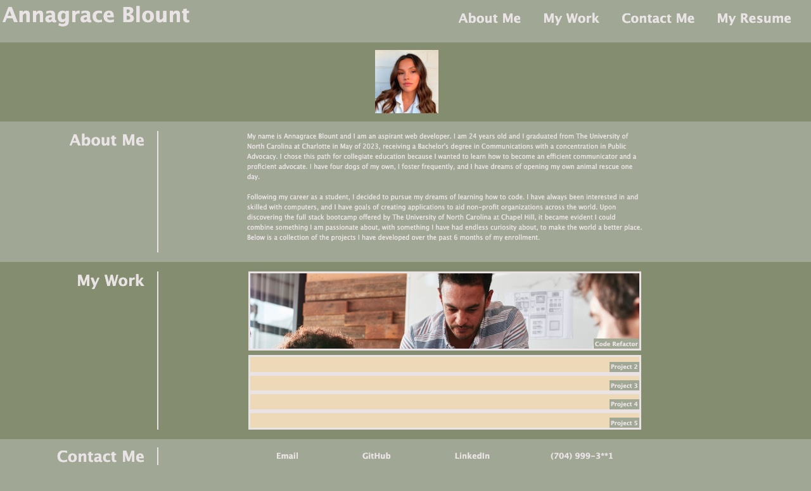

# professionalportfolio-ablount

Description: A professional portfolio to display my work and projects created in the bootcamp.

User Story: As an employer, I want to view a potential employee's deployed portfolio of work samples so that I can review samples of their work and assess whether they're a good candidate for an open position.

Acceptance Criteria: Given I need to sample a potential employee's previous work

When I load their portfolio, then I am presented with the developer's name, a recent photo or avatar, and links to sections about them, their work, and how to contact them

When I click one of the links in the navigation, then the UI scrolls to the corresponding section

When I click on the link to the section about their work, then the UI scrolls to a section with titled images of the developer's applications

When I am presented with the developer's first application, then that application's image should be larger in size than the others

When I click on the images of the applications, then I am taken to that deployed application

When I resize the page or view the site on various screens and devices, then I am presented with a responsive layout that adapts to my viewport

Screenshot:

Link:

